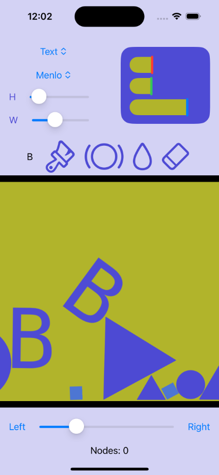
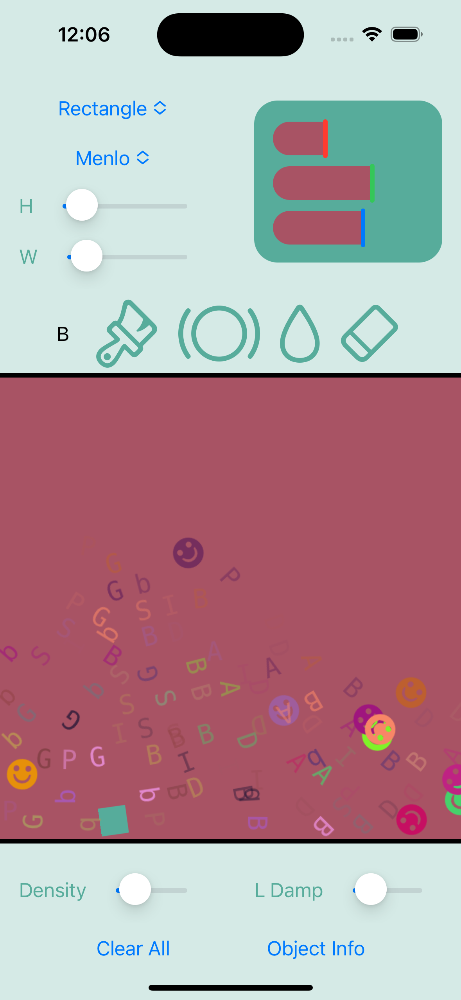
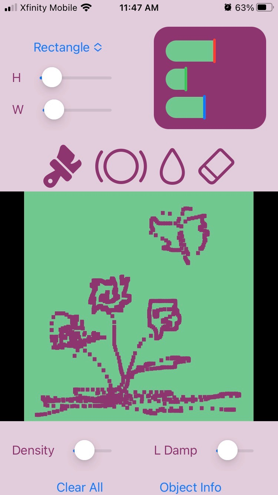
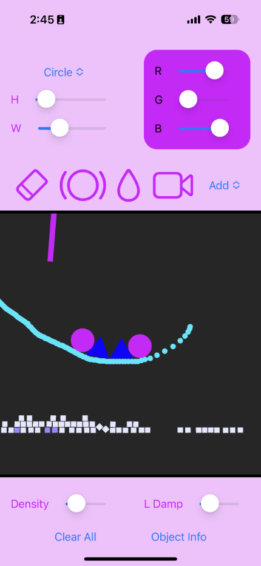
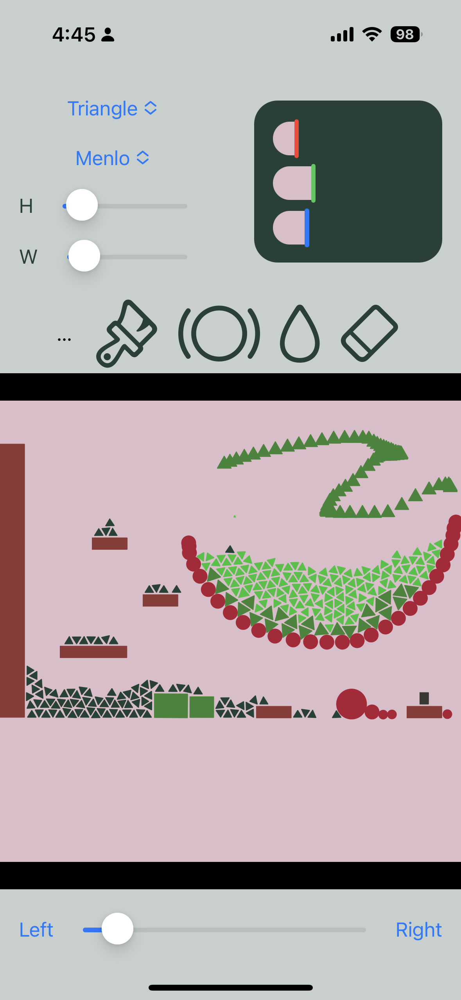

# Physics Playground
## Overview
An interactive setting to test newtonian physics

## Features
### Shape types
Can switch betwen multiple types of shapes to drop in the environment

#### Rectangle
Creates a rectangular shape with size based off of height and width sliders

#### Circle
Creates a circular shape with size based off of width slider

#### Triangle
Creates a triangular shape with size based off of width slider

#### Text
Create a block of a text string entered in by user
- Can be both painted and used as a physics obect
- Can change fonts

#### Data
Drop columns of data in a chain of interconnected objects

### Platform mode
Take control of your shapes!  Tap a shape to activate it, and then tap the left/right buttons at the bottom of the screen to hop in those directions
> Combined with Pinned Mode (below) you can create entire stages with platforms to jump on

### Shape size
Can choose size of each object to drop 

- Use sliders for height and width

### Shape modes
Different modes to place objects in the environment:

#### Paint mode
Draw non-physics objects, creating images in the background of the physics playground

- Enable by tapping the paintbrush icon
- Can combine with any shape type to draw

> Physics objects will not collide with paint

#### Pinned mode
Draw a physics object that is not subject to gravity, which will remain where it is placed.

> Other objects can collide with this object, making it ideal for creating platforms and other static elements

#### Pour mode
Repeatedly drops selected objects while touching the screen
> Can result in slowdown depending on the hardware and number of objects dropped

#### Erase mode
Remove objects placed in the physics playground by touching them